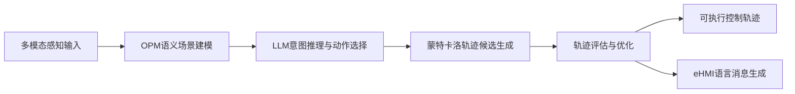
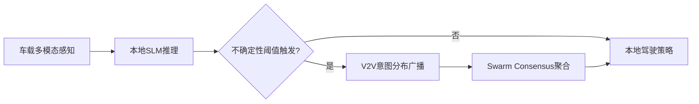

# 自动驾驶论文日报 - 2026-04-28

> 约束校验：仅收录自动驾驶相关论文；无人机/UAV 相关论文 **0** 收录。

<!-- PAPER: arxiv-2604.23513 START -->
## 1. Large Language Model based Interactive Decision-Making for Autonomous Driving

- arXiv： [arXiv:2604.23513](https://arxiv.org/abs/2604.23513)
- 发布日期：2026-04-26

**研究问题**
- 混合交通高冲突场景里，自动驾驶系统常偏保守，缺少与人类车辆的主动交互。
- 感知到决策的链路缺乏显式意图建模，容易造成误判与低效通行。

**核心方法总结**
- 提出 LLM 驱动交互决策框架，把 OPM（对象-过程方法）语义场景建模与 LLM 意图推理结合。
- 先将多车动态抽象为对象、过程、关系，再由 LLM 在安全与效率约束下筛选机动动作。
- 通过蒙特卡洛扰动生成轨迹候选并优化，最终将决策翻译为 eHMI 自然语言消息形成闭环。

**关键亮点 / 贡献**
- 将“语义场景抽象 + 意图推理 + 轨迹优化 + 语言交互”串成可执行闭环。
- 在论文仿真实验中，安全、舒适与效率指标优于对比基线。
- 强调决策可解释性与对周边交通参与者的可沟通性。

**局限或适用边界**
- 结果主要来自仿真与特定场景，真实道路泛化与鲁棒性仍待验证。
- LLM 推理质量对语义建模和提示设计较敏感。

**重点图（方法总览图）**

图注核验：LLM-based Interactive Autonomous Driving Framework with four stages, including scene understanding, behavior decision-making, trajectory planning, and intent interaction for mixed-traffic autonomous driving.

**Mermaid 架构图（根据论文方法整理）**

<!-- PAPER: arxiv-2604.23513 END -->

---

<!-- PAPER: arxiv-2604.22852 START -->
## 2. SwarmDrive: Semantic V2V Coordination for Latency-Constrained Cooperative Autonomous Driving

- arXiv： [arXiv:2604.22852](https://arxiv.org/abs/2604.22852)
- 发布日期：2026-04-22

**研究问题**
- 云端 LLM 推理时延高且依赖稳定连接，本地单车模型在遮挡场景又容易失效。
- 需要在低时延约束下实现多车协同决策，而不是传输重型原始感知数据。

**核心方法总结**
- 提出 SwarmDrive：每辆车本地运行 SLM，仅在不确定性升高时触发事件驱动 V2V 语义通信。
- 交换紧凑意图分布并通过 Swarm Consensus Module 聚合为联合驾驶策略。
- 在遮挡路口原型场景中评估通信配置、参与车数、丢包率和熵阈值对性能影响。

**关键亮点 / 贡献**
- 给出语义级协同方案，在论文实验中兼顾成功率与决策时延。
- 重点验证“高遮挡、低时延”场景下的协作收益，而非仅做离线精度比较。
- 提供对 swarm-size 与触发阈值的消融分析，便于工程调参。

**局限或适用边界**
- 主要基于单一遮挡路口原型与模拟通信设定，尚非真实车路部署验证。
- 参与车辆增加会带来通信开销与丢包上升，系统收益存在规模上限。

**重点图（方法总览图）**

图注核验：System architecture of SwarmDrive where each vehicle runs local multimodal SLM inference, exchanges compact intent-level V2V messages, and fuses them via a Swarm Consensus Module.

**Mermaid 架构图（根据论文方法整理）**

<!-- PAPER: arxiv-2604.22852 END -->

---

## 发布前自检
- 图标题 / 图注核验 / 核心方法三者语义一致：**通过（2 篇）**
- 全文 arXiv 条目均为完整可点击链接：**通过**
- 重点图均对应方法框架（非封面/表格）：**通过（2 张）**
- 报告按“逐篇处理、逐篇落盘、最后总校验”流程完成：**通过**
- 无人机相关论文收录数量：**0**

