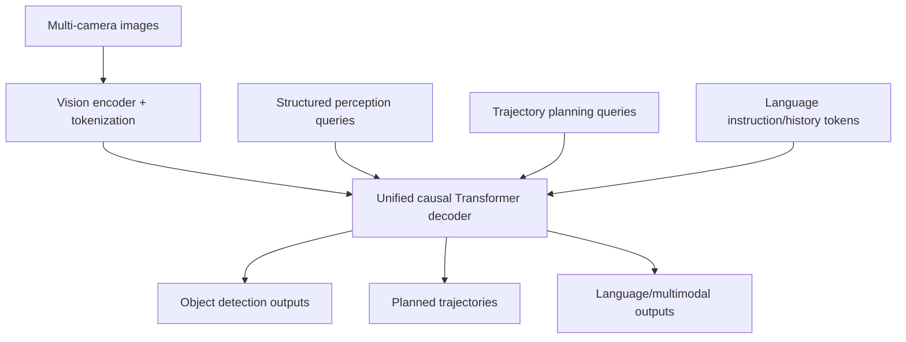
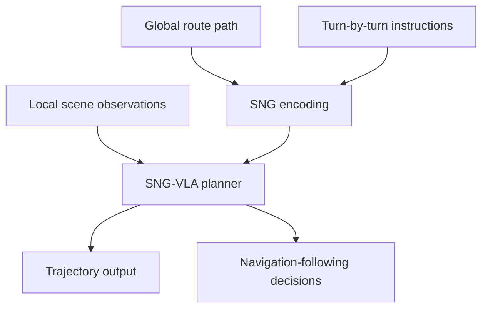

# 自动驾驶论文日报（2026-04-30）

<!-- PAPER: arxiv-2604.17915 START -->
## Unified Multi-Paradigm Driving with Vision-Language-Action Models
- 论文链接：[arXiv:2604.17915](https://arxiv.org/abs/2604.17915)
- 研究问题：如何在同一端到端自动驾驶模型内统一语言生成、目标检测与轨迹规划这三类解码范式，避免多解码器割裂与高延迟。
- 核心方法：在预训练 VLM 的单一因果 Transformer 解码器中统一组织视觉 token、结构化感知 query 与轨迹 query，让结构化输出复用原生注意力骨干完成多任务联合优化。
- 亮点：
  - 单解码器统一感知, 语言, 规划，减少架构碎片化。
  - 在 nuScenes open-loop 报告 0.28 L2 与 0.18 collision rate，并在 NAVSIM closed-loop 达到 86.8 PDMS。
  - 提供高效推理模式，延迟下降约 40%。
- 局限：对高质量预训练 VLM 依赖较强；跨城市分布外泛化与安全可解释性仍需更多闭环验证。

### 重点图
重点图暂缺（质量门禁未通过）

### 方法架构 Mermaid

<!-- PAPER: arxiv-2604.17915 END -->

<!-- PAPER: arxiv-2604.12208 START -->
## Unveiling the Surprising Efficacy of Navigation Understanding in End-to-End Autonomous Driving
- 论文链接：[arXiv:2604.12208](https://arxiv.org/abs/2604.12208)
- 研究问题：现有端到端驾驶模型常过度依赖局部视觉而弱化全局导航信号，导致复杂路口与转向场景下跟导航能力不足。
- 核心方法：提出 Sequential Navigation Guidance (SNG) 表征，将导航路径约束与 turn-by-turn 语义编码为顺序引导；并构建 SNG-QA 数据集训练 SNG-VLA 融合全局导航与局部感知规划。
- 亮点：
  - 显式建模“全局路径 + 即时转向逻辑”，提升导航可用性。
  - 不依赖额外感知辅助损失仍达 SOTA。
  - 面向真实导航模式设计，工程可落地性更强。
- 局限：对导航先验质量与地图一致性敏感；在极端动态交通中的稳健性仍待更大规模闭环评测。

### 重点图
重点图暂缺（质量门禁未通过）

### 方法架构 Mermaid

<!-- PAPER: arxiv-2604.12208 END -->
