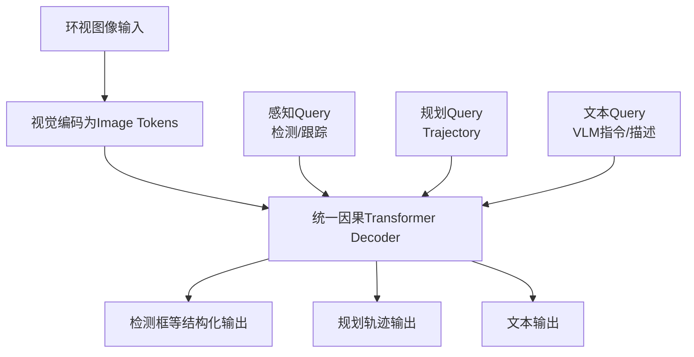

# 自动驾驶论文日报（2026-05-01）

<!-- PAPER: arxiv-2604.17915 START -->
## Unified Multi-Paradigm Driving with Vision-Language-Action Models

- arXiv链接：[arXiv:2604.17915](https://arxiv.org/abs/2604.17915)
- 研究问题：如何在同一端到端自动驾驶模型中统一语言生成、目标检测与轨迹规划等异构解码任务，避免多解码器架构割裂。
- 核心方法：基于预训练VLM/LLM，将图像token、结构化感知query、规划轨迹query统一放入单一因果Transformer解码器，通过共享注意力骨干实现多任务联合优化。
- 亮点：
  - 单解码器统一多范式驾驶任务，减少系统拼接复杂度。
  - 在nuScenes open-loop上报告0.28 L2、0.18 collision rate，在NAVSIM closed-loop达到86.8 PDMS。
  - 保留多模态生成能力，并提供约40%低时延推理模式。
- 局限：
  - 对高质量预训练骨干与多任务标注依赖较强。
  - 统一解码器在极端长序列/密集场景下的稳定性与可解释性仍需更多验证。

**重点图**：重点图暂缺（质量门禁未通过）

<!-- PAPER: arxiv-2604.17915 END -->
