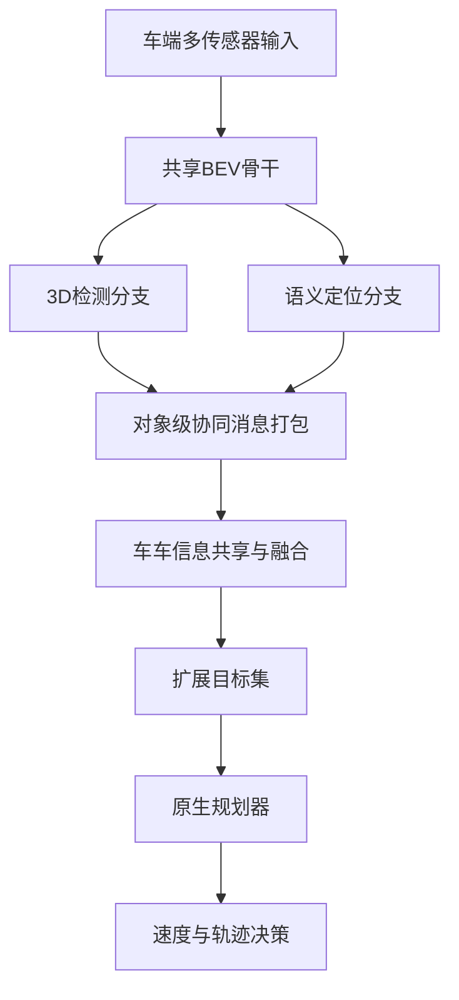

# 自动驾驶论文日报（2026-05-04）

<!-- PAPER: arxiv-2604.14454 START -->
## CooperDrive: Enhancing Driving Decisions Through Cooperative Perception

- arXiv链接：[arXiv:2604.14454](https://arxiv.org/abs/2604.14454)
- 研究问题：在遮挡与非视距路口场景下，单车感知会导致风险感知滞后；如何在不重构现有规划系统的前提下，把协同感知稳定转化为更早、更安全的驾驶决策。
- 核心方法：提出 CooperDrive 框架，在车端复用检测网络的 BEV 特征联合完成3D检测与语义定位，再以轻量对象级共享/融合把扩展目标集输入原生规划栈，使规划从“事后反应”转为“提前预判”。
- 亮点：
  - 不要求替换车辆既有 perception-localization-planning 主干，仅通过协同接口增强规划输入。
  - 面向真实车闭环路口测试，报告更早反应时间、更高最小时距碰撞时间（TTC）与更大刹停裕度。
  - 通信与时延开销较低：约 90 kbps 带宽、89 ms 端到端平均延迟。
- 局限：
  - 论文主要验证于特定遮挡路口与车队协同设置，跨城市/跨传感器泛化仍需更多实证。
  - 对车间通信质量存在依赖，弱网或高丢包情况下的稳定性边界仍需系统评估。

**重点图**：重点图暂缺（质量门禁未通过）

<!-- PAPER: arxiv-2604.14454 END -->

