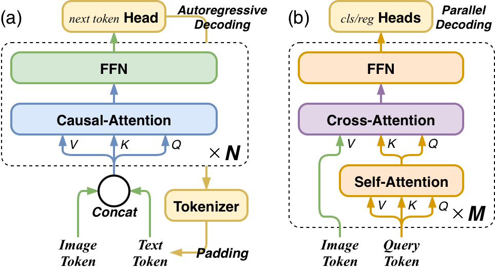
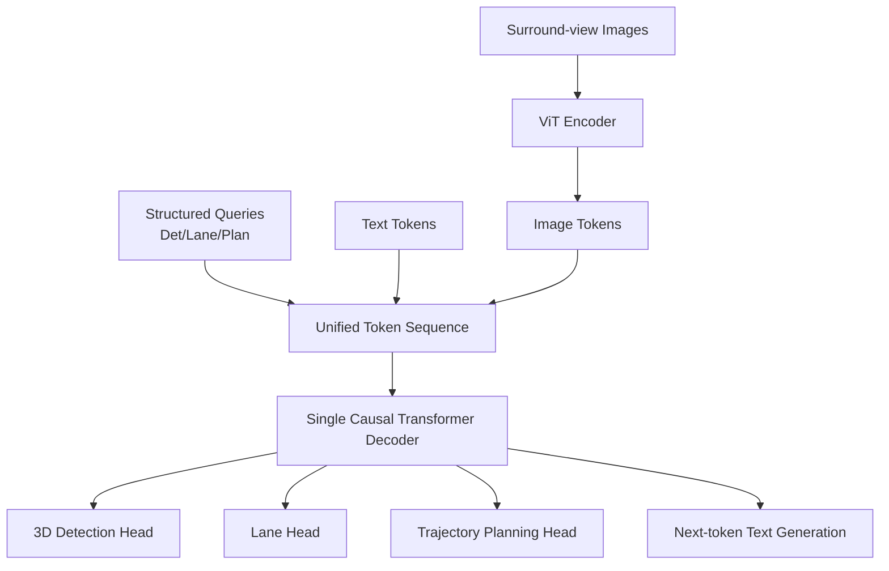
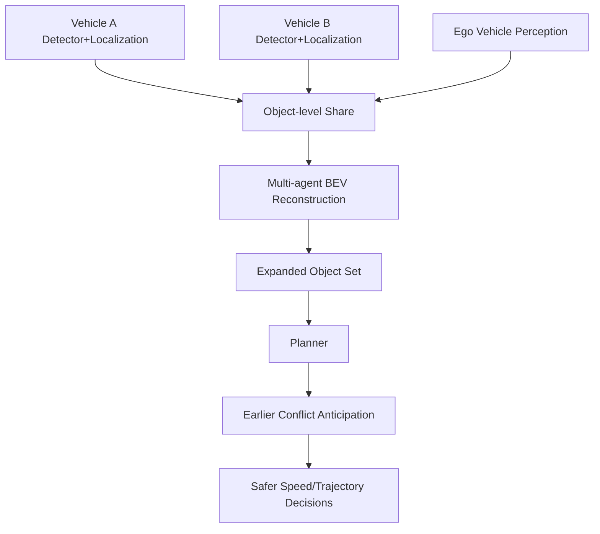
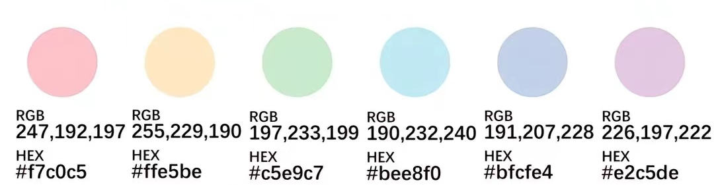
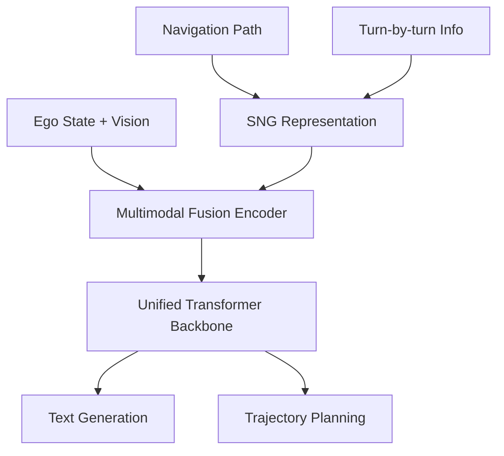

# 自动驾驶论文日报（2026-05-05）

<!-- PAPER: arxiv-2604.17915 START -->
## OneDrive: Unified Multi-Paradigm Driving with Vision-Language-Action Models
- 论文链接：[arXiv:2604.17915](https://arxiv.org/abs/2604.17915)
- 研究问题：现有端到端自动驾驶通常把语言生成、感知检测、轨迹规划拆成多个解码器，导致架构割裂与骨干复用不足。
- 核心方法：OneDrive 在预训练 VLM 上用**单一因果 Transformer 解码器**统一文本 token 与结构化查询 token（检测/车道/规划），通过共享注意力骨干完成异构任务联合学习。
- 亮点：
  - 在统一解码器内同时支持自回归文本和并行结构化输出。
  - 规划查询与视觉/感知 token 共用预训练注意力，减少额外模块。
  - 报告了 nuScenes 与 NAVSIM 上有竞争力结果，并给出低延迟推理模式。
- 局限：方法依赖大模型预训练与多任务协同训练稳定性；对算力与数据质量要求较高。

**重点图（方法架构）**

图注核验：Figure 3 describes OneDrive architecture: surround-view images become image tokens, fused with structured queries and text tokens, then decoded by a mixed decoder with shared causal attention and task-specific heads.

<!-- PAPER: arxiv-2604.17915 END -->

<!-- PAPER: arxiv-2604.14454 START -->
## CooperDrive: Enhancing Driving Decisions Through Cooperative Perception
- 论文链接：[arXiv:2604.14454](https://arxiv.org/abs/2604.14454)
- 研究问题：单车智能在遮挡与非视距（NLOS）路口容易晚反应，导致碰撞风险提升。
- 核心方法：CooperDrive 通过**对象级协同感知**把多车检测/定位信息融合到重建 BEV 中，再把扩展后的对象集输入规划器，实现更早的冲突预判与速度轨迹调整。
- 亮点：
  - 保留各车原生感知-定位-规划栈，工程落地友好。
  - 复用检测 BEV 特征估计位姿，无需额外重型编码器。
  - 实车闭环报告了更早反应、更高 TTC 与更大停车裕度，同时维持低带宽低时延。
- 局限：对车路协同通信稳定性与多车同步质量敏感；在通信退化场景下收益可能下降。

**重点图（方法架构）**

图注核验：Figure 2 shows reconstructed BEV from cooperative perception, where each vehicle shares localization and detection outputs from a multi-task BEV perception network to improve situational awareness and safer path planning.

<!-- PAPER: arxiv-2604.14454 END -->

<!-- PAPER: arxiv-2604.12208 START -->
## Unveiling the Surprising Efficacy of Navigation Understanding in End-to-End Autonomous Driving
- 论文链接：[arXiv:2604.12208](https://arxiv.org/abs/2604.12208)
- 研究问题：许多端到端驾驶模型过度依赖局部场景而忽视全局导航信息，导致复杂场景下“跟导航走”的能力不足。
- 核心方法：提出 Sequential Navigation Guidance（SNG），把导航路径与 turn-by-turn（TBT）信息联合编码；并构建 SNG-QA 与 SNG-VLA，把全局导航约束和局部感知规划在统一骨干中融合。
- 亮点：
  - 将“全局路径约束 + 实时转向语义”显式注入端到端规划。
  - 通过 SNG-QA 对齐全局与局部规划监督。
  - 在不依赖额外感知辅助损失下取得有竞争力表现。
- 局限：方法收益依赖导航先验质量；当导航信号噪声或偏移较大时，鲁棒性仍需进一步验证。

**重点图（方法架构）**

图注核验：Figure 3 presents the pipeline: sequential navigation guidance combines navigation path and turn-by-turn information, while the model uses a multimodal fusion encoder and a unified transformer backbone for text generation and trajectory planning.

<!-- PAPER: arxiv-2604.12208 END -->

