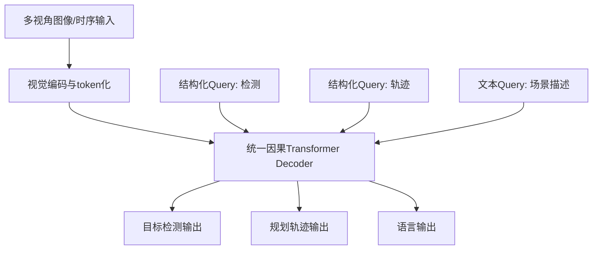
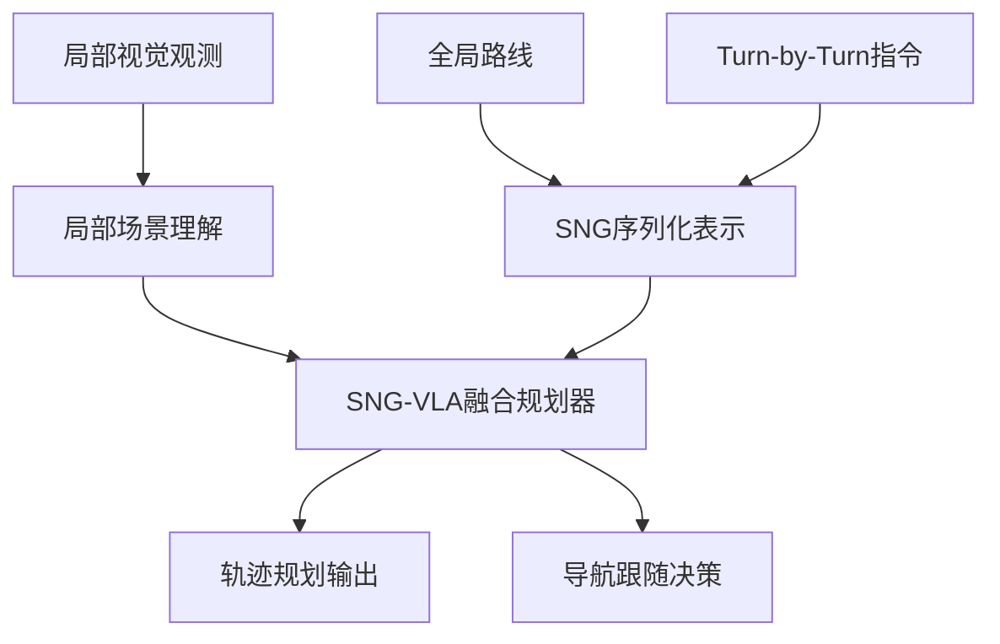

# 自动驾驶论文日报 - 2026-05-06

> 数据来源：arXiv（仅 abs + 本地 PDF）

<!-- PAPER: arxiv-2604.17915 START -->
## Unified Multi-Paradigm Driving with Vision-Language-Action Models
- arXiv链接：[arXiv:2604.17915](https://arxiv.org/abs/2604.17915)
- 研究问题：现有端到端自动驾驶常用多解码器（语言/检测/轨迹分开），导致结构割裂、复用差、联合训练不稳定。
- 核心方法：提出 OneDrive，在单一因果 Transformer 解码器内统一文本生成、目标检测与轨迹规划；通过共享注意力主干，把视觉 token 与结构化 query token 放进同一序列联合解码。
- 亮点：
  - 在不拆分任务头的前提下实现多范式解码统一。
  - 强调“预训练注意力可迁移，FFN 迁移弱”的设计洞察。
  - 以结构化轨迹 query 在同一 LLM decoder 中完成规划输出。
- 局限：对 token 编排与训练策略较敏感；统一解码器在极端场景下的可解释性和延迟开销仍需更多实车验证。

**重点图**

图注核验：Figure 1 contrasts dual-decoder and cascaded-decoder baselines with the proposed unified single-decoder framework that handles heterogeneous driving tasks in one transformer.

<!-- PAPER: arxiv-2604.17915 END -->

<!-- PAPER: arxiv-2604.12208 START -->
## Unveiling the Surprising Efficacy of Navigation Understanding in End-to-End Autonomous Driving
- arXiv链接：[arXiv:2604.12208](https://arxiv.org/abs/2604.12208)
- 研究问题：许多端到端驾驶模型对局部视觉过拟合、对全局导航信息利用不足，复杂路口下“按导航行驶”能力弱。
- 核心方法：提出 Sequential Navigation Guidance（SNG）表示，将导航路径约束与 turn-by-turn 指令统一编码，并结合 SNG-QA 数据与 SNG-VLA 融合模型对齐全局导航与局部规划。
- 亮点：
  - 明确验证“错误/随机导航扰动影响小”的行业痛点。
  - 用顺序化导航表示增强长程规划一致性与实时决策。
  - 在无需复杂辅助损失下提升导航跟随能力。
- 局限：对高质量导航先验依赖较强；跨城市地图差异与罕见交通规则场景的泛化还需进一步评估。

**重点图**

图注核验：Figure 1 presents command-perturbation ablations, showing random or wrong navigation signals barely affect baseline performance, while SNG significantly improves navigation-following and planning quality.

<!-- PAPER: arxiv-2604.12208 END -->

