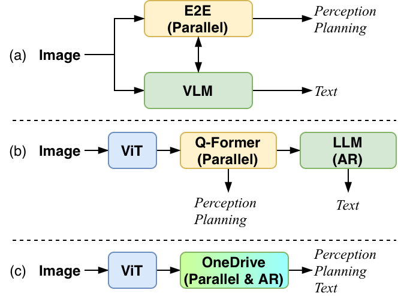
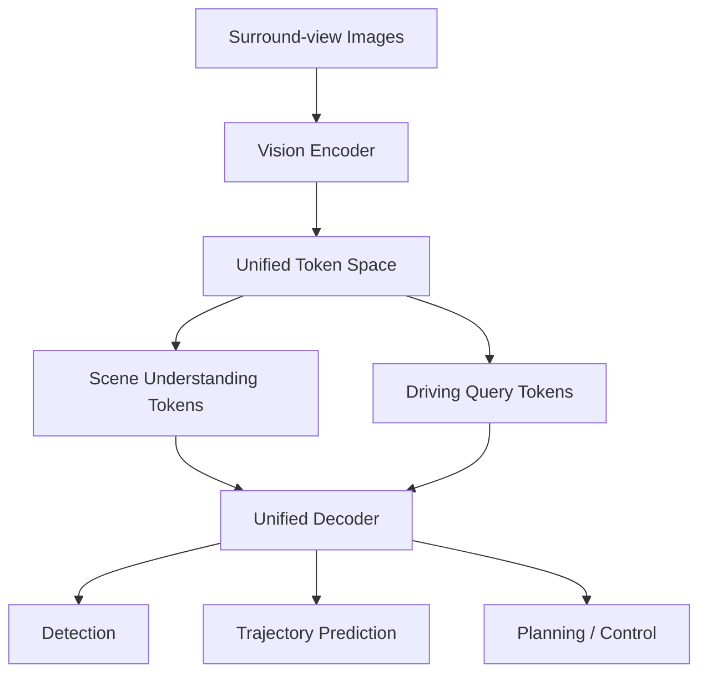
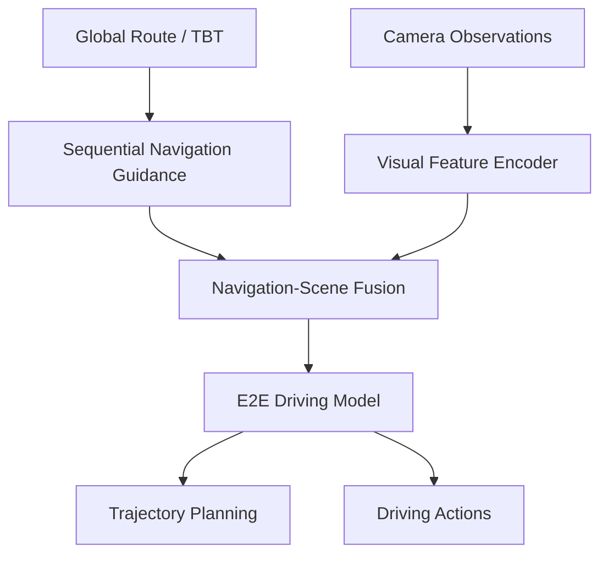
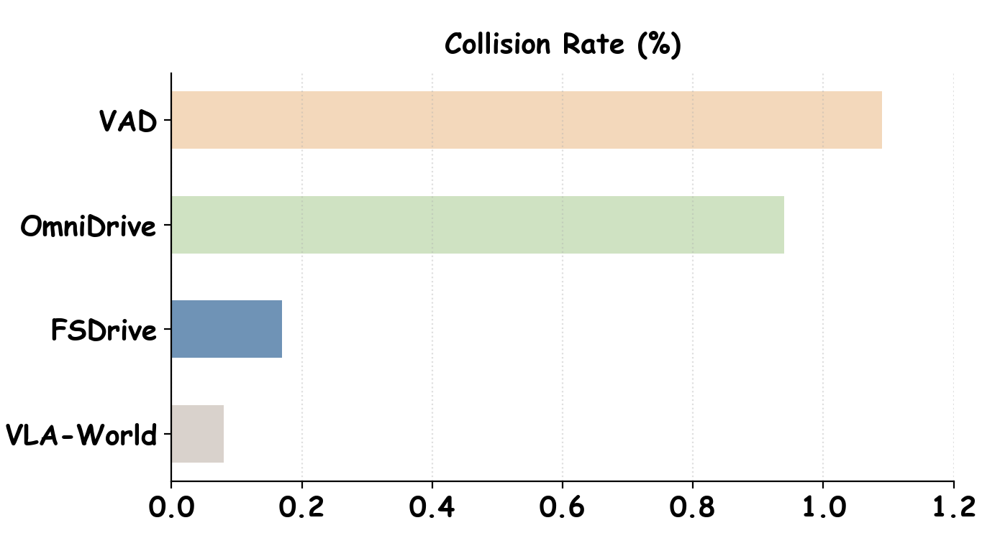
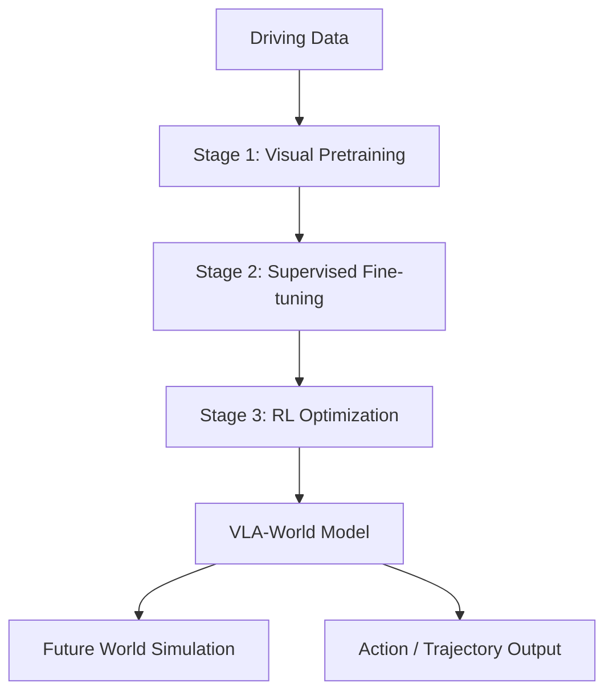

# 自动驾驶论文日报 - 2026-05-07

<!-- PAPER: arxiv-2604.17915 START -->
## Unified Multi-Paradigm Driving with Vision-Language-Action Models
- 论文链接：[arXiv:2604.17915](https://arxiv.org/abs/2604.17915)
- 研究问题：统一自动驾驶中自回归文本、多目标检测与轨迹回归等“异构解码范式”，减少多头系统割裂与误差传递。
- 核心方法：提出 **OneDrive** 统一架构，将多任务输出映射为可协同的 token 序列，结合单干路表征与任务特定解码机制，在同一模型内完成感知-预测-规划。
- 亮点：
  - 把“并行结构化输出 + 自回归语言推理”放进同一 VLA 框架。
  - 通过统一 token 接口降低模块耦合成本，便于端到端训练。
  - 面向真实驾驶任务的多范式联合学习，强调系统级一致性。
- 局限：图文中对极端长尾场景与闭环安全约束的定量分析仍有限，工程部署细节（时延/算力）披露不充分。

**重点图（方法架构）**

图注核验：Architecture of OneDrive encodes surround-view images into visual tokens, fuses scene understanding with driving queries, and performs unified multi-task decoding for perception, prediction, and planning.

<!-- PAPER: arxiv-2604.17915 END -->

<!-- PAPER: arxiv-2604.12208 START -->
## Unveiling the Surprising Efficacy of Navigation Understanding in End-to-End Autonomous Driving
- 论文链接：[arXiv:2604.12208](https://arxiv.org/abs/2604.12208)
- 研究问题：为何端到端自动驾驶常“重局部视觉、轻全局导航”，导致规划与导航目标关联不足。
- 核心方法：提出导航理解增强流程（以顺序导航引导为核心），将导航路径与 turn-by-turn 信息结构化注入模型训练与推理，强化全局意图对轨迹规划的约束。
- 亮点：
  - 明确验证了导航信息扰动对规划性能的敏感性。
  - 给出端到端系统“导航可用性”诊断视角。
  - 通过导航先验增强，改善复杂路口与长程目标一致性。
- 局限：方法依赖高质量导航先验；对地图误差、GPS 漂移和跨城泛化的鲁棒性仍需更系统验证。

**重点图（方法流程）**

图注核验：Overview pipeline integrates sequential navigation guidance, including route path and turn-by-turn cues, then aligns these global signals with scene features to improve end-to-end planning consistency.

<!-- PAPER: arxiv-2604.12208 END -->

<!-- PAPER: arxiv-2604.09059 START -->
## Learning Vision-Language-Action World Models for Autonomous Driving
- 论文链接：[arXiv:2604.09059](https://arxiv.org/abs/2604.09059)
- 研究问题：VLA 驾驶模型缺少显式时序世界建模，前瞻能力与安全冗余不足。
- 核心方法：提出 **VLA-World**，通过“视觉生成预训练 → 监督微调 → 强化学习”三阶段，把世界模型能力注入 VLA，实现可解释的未来状态推演与决策。
- 亮点：
  - 在统一框架中结合 world model 与 VLA，增强 long-horizon foresight。
  - 三阶段训练路径清晰，兼顾表征学习与策略优化。
  - 支持从视觉上下文到动作决策的闭环一致建模。
- 局限：训练链路较长、资源开销高；对开放世界 domain shift 的稳健性与线上安全验证仍需补充。

**重点图（训练与推理主流程）**

图注核验：The framework learns in three progressive stages: activate visual generation, align multimodal supervision, and optimize policy with reinforcement learning for consistent world modeling and action prediction.

<!-- PAPER: arxiv-2604.09059 END -->
