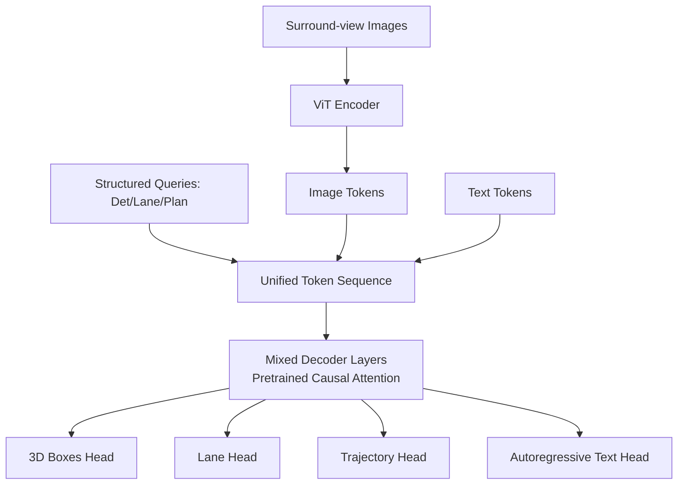
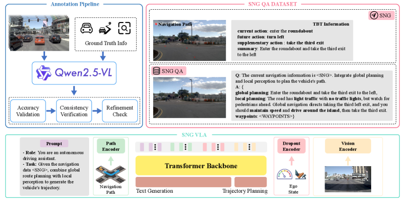
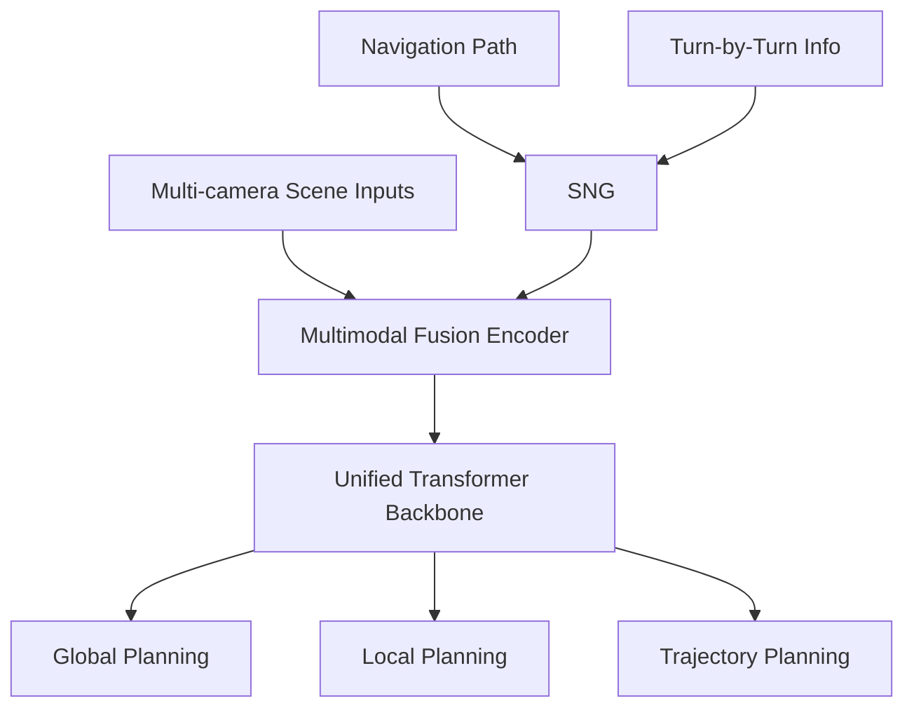

# 自动驾驶论文日报 - 2026-05-08

<!-- PAPER: arxiv-2604.17915 START -->
## Unified Multi-Paradigm Driving with Vision-Language-Action Models

- arXiv: [arXiv:2604.17915](https://arxiv.org/abs/2604.17915)
- 研究问题：如何在同一端到端自动驾驶模型里统一“自回归语言生成”与“并行感知/规划结构化输出”，减少多解码器割裂与延迟。
- 核心方法：提出 OneDrive，把图像 token、感知查询 token、规划查询 token、文本 token 拼成统一序列，在预训练 VLM 的因果注意力骨干上联合训练；仅在结构化查询分支加轻量任务适配头。
- 亮点：
  - 单解码器统一感知+规划+语言，保留预训练注意力迁移能力。
  - 在 nuScenes open-loop 与 NAVSIM closed-loop 上报告了有竞争力指标。
  - 提供高效推理模式，降低推理时延。
- 局限：
  - 依赖高质量多任务标注与较大预训练骨干，训练/部署成本仍高。
  - 文中主要在既定 benchmark 验证，跨城市泛化与长尾安全场景仍需更多公开证据。

**重点图（方法架构图）**

图注核验：Architecture of OneDrive with ViT image tokens, structured detection/lane/planning queries, and text tokens in one mixed decoder using pretrained causal attention plus task-specific heads.

<!-- PAPER: arxiv-2604.17915 END -->

<!-- PAPER: arxiv-2604.12208 START -->
## Unveiling the Surprising Efficacy of Navigation Understanding in End-to-End Autonomous Driving

- arXiv: [arXiv:2604.12208](https://arxiv.org/abs/2604.12208)
- 研究问题：现有端到端驾驶是否真正利用了全局导航信息，还是过度依赖局部场景理解。
- 核心方法：提出 Sequential Navigation Guidance (SNG)，把导航路径与 turn-by-turn 信息联合建模；构建 SNG-QA 数据；提出 SNG-VLA 融合局部感知与全局导航进行规划。
- 亮点：
  - 揭示“命令扰动对性能影响小”的现象，诊断了导航理解不足问题。
  - 用更结构化导航表示替代粗粒度 one-hot 指令，提升导航跟随能力。
  - 在 NAVSIM / Bench2Drive 等评测上给出提升结果。
- 局限：
  - 方案对导航先验与问答式监督构建质量敏感。
  - 文中闭环增益仍需在更多真实复杂交通域长期验证。

**重点图（方法总览图）**

图注核验：Overview of the pipeline: SNG combines navigation path and turn-by-turn cues, SNG-QA has global/local/trajectory subtasks, and SNG-VLA uses multimodal fusion encoder plus unified transformer backbone.

<!-- PAPER: arxiv-2604.12208 END -->

