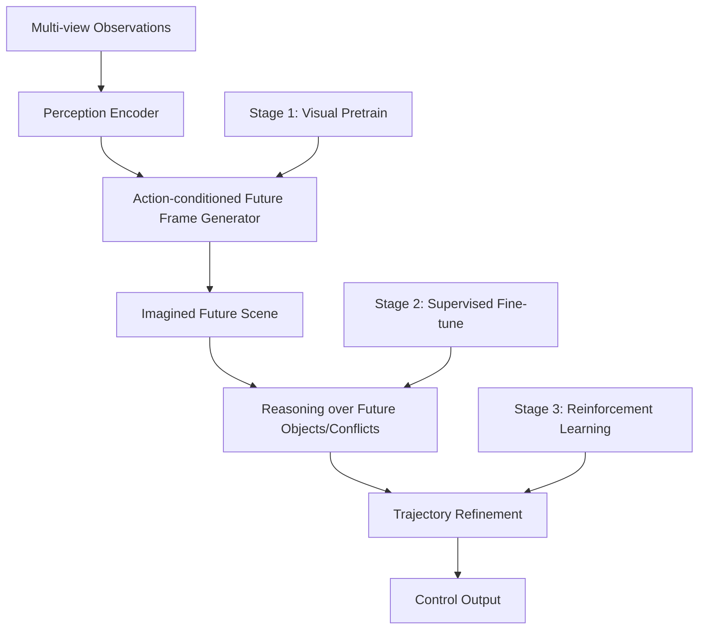
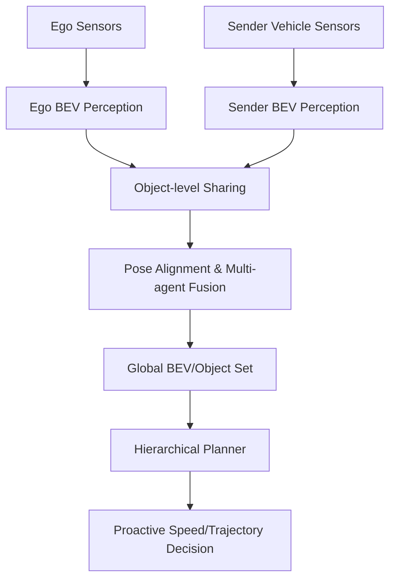

# 自动驾驶论文日报 - 2026-05-09

<!-- PAPER: arxiv-2604.09059 START -->
## Learning Vision-Language-Action World Models for Autonomous Driving

- arXiv: [arXiv:2604.09059](https://arxiv.org/abs/2604.09059)
- 研究问题：端到端 VLA 驾驶模型缺乏显式时序世界建模，导致对未来风险的前瞻能力不足；纯 world model 又缺少面向驾驶决策的可解释推理闭环。
- 核心方法：提出 VLA-World，把“动作条件的未来帧生成”与“基于想象未来的反思式轨迹修正”串成统一闭环；并通过三阶段训练（视觉生成预训练→监督微调→强化学习）学习从感知到规划的前瞻决策。
- 亮点：
  - 把 future imagination 与 planning refinement 联动，提升规划与生成两类指标。
  - 构建 nuScenes-GR-20K 生成推理数据，支撑“看未来再决策”的监督信号。
  - 引入强化学习阶段，利用生成未来场景进行策略探索，改善安全相关表现（如碰撞率）。
- 局限：
  - 依赖高质量未来帧生成，若生成偏差累积可能误导后续推理与轨迹优化。
  - 训练流程分阶段且成本较高，对数据规模与算力较敏感。

**重点图（方法架构图）**

重点图暂缺（质量门禁未通过）

图注核验：Figure 1 depicts a three-stage pipeline where VLA-World learns visual generation, then links perception-future-thinking-planning, and finally improves decisions via reinforcement learning over imagined futures.

<!-- PAPER: arxiv-2604.09059 END -->

<!-- PAPER: arxiv-2604.14454 START -->
## CooperDrive: Enhancing Driving Decisions Through Cooperative Perception

- arXiv: [arXiv:2604.14454](https://arxiv.org/abs/2604.14454)
- 研究问题：单车感知在遮挡与非视距（NLOS）路口存在先天盲区，导致危险目标发现滞后，规划只能被动制动与规避。
- 核心方法：提出 CooperDrive，在不改动各车原有感知/定位/规划栈的前提下，进行轻量目标级协同共享；复用检测 BEV 特征完成位姿估计与多车融合，再把扩展目标集输入层级规划器，实现更早冲突预判与速度轨迹调整。
- 亮点：
  - 强调“兼容现有车端栈”的协同接口设计，工程落地门槛较低。
  - 关注感知到规划的端到端收益，而非仅检测精度，且给出真实车辆闭环验证。
  - 在低通信开销（文中约 90 kbps）与可控延迟下提升反应提前量与 TTC 安全裕度。
- 局限：
  - 性能受车间通信质量与时延波动影响，极端网络条件下稳定性仍需更多验证。
  - 方法核心依赖跨车位姿与目标对齐精度，定位误差会直接传导到规划决策。

**重点图（方法架构图）**

重点图暂缺（质量门禁未通过）

图注核验：The framework combines multi-task perception and localization to build shared BEV/object information, then feeds a conventional planner with fused multi-agent context for earlier conflict anticipation.

<!-- PAPER: arxiv-2604.14454 END -->

