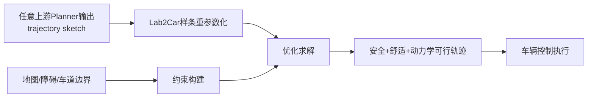

# 自动驾驶论文日报（2026-05-11）

<!-- PAPER: arxiv-2406.02916 START -->
## Real-time Motion Planning for autonomous vehicles in dynamic environments
- 链接：[arXiv:2406.02916](https://arxiv.org/abs/2406.02916)
- 研究问题：在含动态障碍（含速度/加速度变化）的道路环境中，如何兼顾轨迹安全性、实时性与可执行性。
- 核心方法：提出“全局+局部”分层规划框架：全局层改进 A* 生成参考路径；局部层采用 Time Elastic Band，并引入动态障碍预测（Kalman + 常加速度模型）。同时通过曲率驱动的 waypoint 密度自适应，提高弯道精度并降低直道计算负担。
- 亮点：
  - 曲率加权的时间间隔设计，把算力集中在高曲率路段。
  - 同时建模动态障碍运动学，提高动态场景下的避障稳定性。
  - 方法可迁移到不同车辆平台与移动机器人。
- 局限：
  - 以工程组合优化为主，对端到端学习策略融合较少。
  - 对高密度交互场景（多车博弈）上限仍受预测模型简化假设影响。

### 重点图（方法对应）
重点图暂缺（质量门禁未通过）

### Mermaid 架构图

<!-- PAPER: arxiv-2406.02916 END -->

<!-- PAPER: arxiv-2409.09523 START -->
## Lab2Car: A Versatile Wrapper for Deploying Experimental Planners in Complex Real-world Environments
- 链接：[arXiv:2409.09523](https://arxiv.org/abs/2409.09523)
- 研究问题：实验性规划器（含学习式规划器）在真实复杂道路中难以直接满足安全、舒适和动力学约束，导致“实验室到实车”部署鸿沟。
- 核心方法：Lab2Car 作为优化式 wrapper，接收任意 planner 给出的 trajectory sketch，在样条空间中重参数化并施加可行域/舒适性/碰撞约束，输出可跟踪、安全且平顺的可执行轨迹。
- 亮点：
  - 对上游规划器“即插即用”，可快速验证不同候选 planner。
  - 在真实城市场景（cut-in、yield、overtake）展示部署效果。
  - 同时兼顾安全约束与乘坐舒适性，工程落地价值高。
- 局限：
  - wrapper 质量受上游 sketch 初值质量影响。
  - 额外优化层引入实时性开销，极端时延预算下仍需裁剪。

### 重点图（方法对应）
重点图暂缺（质量门禁未通过）

### Mermaid 架构图

<!-- PAPER: arxiv-2409.09523 END -->

