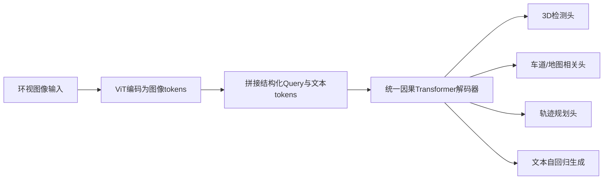
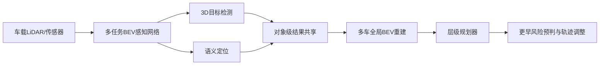

# 自动驾驶论文日报 - 2026-05-13

## 今日新增

<!-- PAPER: arxiv-2604.17915 START -->
### Unified Multi-Paradigm Driving with Vision-Language-Action Models
- arXiv: [arXiv:2604.17915](https://arxiv.org/abs/2604.17915)
- 研究问题：如何在一个统一框架中同时支持自动驾驶中的异构任务输出（文本生成、并行感知、轨迹规划），避免多解码器割裂导致的训练与信息流瓶颈。
- 核心方法：提出 OneDrive，在单一 Transformer 因果解码器内统一组织图像 token、结构化 query token 与文本 token；保留可迁移的预训练注意力骨干，在浅层加入感知 query 的额外交互与任务特定 FFN，实现“同一解码器内并行结构化预测 + 自回归文本生成 + 轨迹规划查询”。
- 亮点：
  - 把 VLM 预训练注意力直接迁移到自动驾驶多任务解码，减少架构碎片化；
  - 在 nuScenes open-loop 与 NAVSIM closed-loop 上均报告强表现；
  - 提供“完整能力模式”与“截断推理模式”，在规划部署场景下降低延迟（文中约 40%）。
- 局限：
  - 方法依赖大模型预训练底座与多任务联合训练稳定性；
  - 复杂统一解码器的调参与资源成本较高；
  - 跨城市/跨传感器域泛化能力仍需更多独立复现与公开评测。

**重点图**：重点图暂缺（质量门禁未通过）
图注核验：Figure 3 describes OneDrive’s unified architecture where image, query, and text tokens are jointly processed by mixed decoder layers, enabling parallel detection/lane/planning outputs plus autoregressive language generation.

<!-- PAPER: arxiv-2604.17915 END -->

<!-- PAPER: arxiv-2604.14454 START -->
### Enhancing Driving Decisions Through Cooperative Perception
- arXiv: [arXiv:2604.14454](https://arxiv.org/abs/2604.14454)
- 研究问题：在遮挡与非视距路口中，单车感知容易导致决策滞后；如何以低带宽、低延迟方式把协同感知真正转化为更安全的规划收益。
- 核心方法：提出 CooperDrive。单车侧通过多任务 BEV 网络联合完成 3D 检测与语义定位；车间共享对象级结果并在全局坐标系重建多车 BEV 表征，直接喂给既有层级规划器，实现无需改造规划栈的协同增强。
- 亮点：
  - 强调“可落地”协同：对象级共享，带宽需求低（文中约 90 kbps）；
  - 在真实车辆闭环 NLOS 场景验证规划收益（更早反应、更高最小 TTC、更大停车裕度）；
  - 感知-定位-规划接口清晰，便于兼容已有自动驾驶系统。
- 局限：
  - 主要验证集中于特定路口与测试条件，规模化泛化仍待扩展；
  - 性能受通信质量与时延抖动影响；
  - 对多车高密场景下的融合冲突与鲁棒性仍需进一步系统评估。

**重点图**：重点图暂缺（质量门禁未通过）
图注核验：Figure 2 summarizes cooperative BEV reconstruction, where each vehicle contributes localization and detection outputs from a multi-task BEV perception network to improve situational awareness and downstream path planning.

<!-- PAPER: arxiv-2604.14454 END -->
