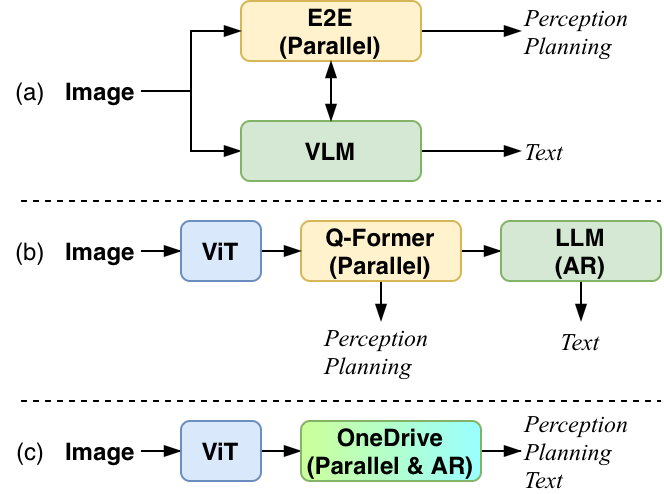
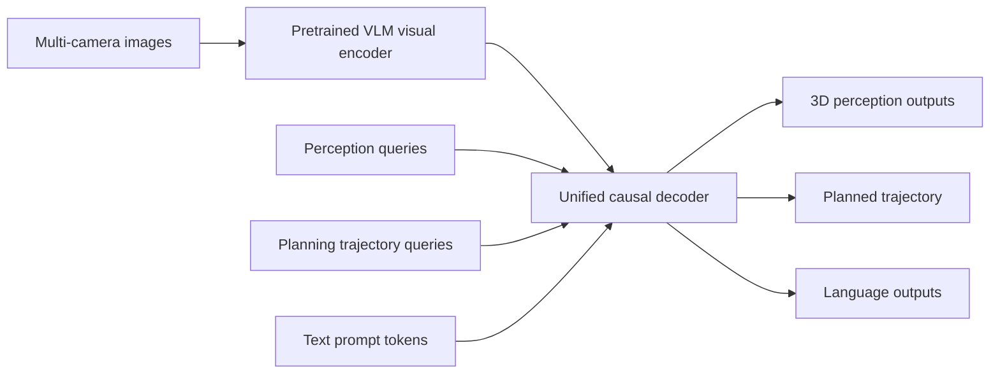
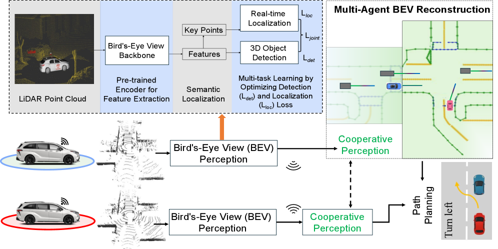
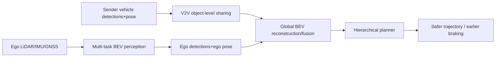

# 自动驾驶论文日报 - 2026-05-14

<!-- PAPER: arxiv-2604.17915 START -->
## OneDrive: Unified Multi-Paradigm Driving with Vision-Language-Action Models
- arXiv: [arXiv:2604.17915](https://arxiv.org/abs/2604.17915)
- 研究问题：如何在**单一预训练VLM解码器**中同时支持文本自回归、并行感知与轨迹规划，避免多解码器割裂。
- 核心方法：提出 OneDrive，把视觉token与结构化query token统一到一个因果Transformer解码器；保留可迁移的attention主干，在浅层增加query间注意力与任务特定FFN以支持检测/规划。
- 亮点：
  - 统一架构下多任务联合优化，减少模块级信息壁垒。
  - 在 nuScenes 与 NAVSIM 上达到SOTA/竞争性闭环表现。
  - 推理裁剪模式显著降时延（文中报告约40%）。
- 局限：对大规模VLM预训练质量依赖高；复杂场景鲁棒性与跨域泛化仍需更多闭环验证。

**重点图（方法架构）**

图注核验：Figure 1 contrasts dual-decoder and cascaded designs with OneDrive’s unified single-decoder transformer, showing how heterogeneous driving tasks are handled in one shared backbone.

**Mermaid 架构图**

<!-- PAPER: arxiv-2604.17915 END -->

<!-- PAPER: arxiv-2604.14454 START -->
## CooperDrive: Enhancing Driving Decisions Through Cooperative Perception
- arXiv: [arXiv:2604.14454](https://arxiv.org/abs/2604.14454)
- 研究问题：在遮挡/NLOS路口中，如何让协同感知真正转化为更安全、更提前的规划决策，而不仅是感知指标提升。
- 核心方法：提出 CooperDrive，多车端保留原生栈，仅共享轻量目标级信息；通过多任务BEV感知网络同时做检测与定位，将多车结果重建到全局BEV供分层规划器直接使用。
- 亮点：
  - 不改原规划器接口即可接入协同信息。
  - 真车闭环验证在遮挡路口提升反应提前量与安全裕度。
  - 通信与时延开销低（文中报告约90 kbps、89 ms平均端到端时延）。
- 局限：验证场景与车队规模仍有限；对通信稳定性和定位精度仍存在依赖。

**重点图（方法相关BEV重建）**

图注核验：Figure 2 shows reconstructed BEV from cooperative perception, where vehicles contribute localization and detections from the multi-task BEV network to improve situational awareness for safer planning.

**Mermaid 架构图**

<!-- PAPER: arxiv-2604.14454 END -->
