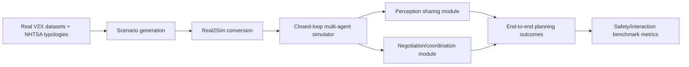
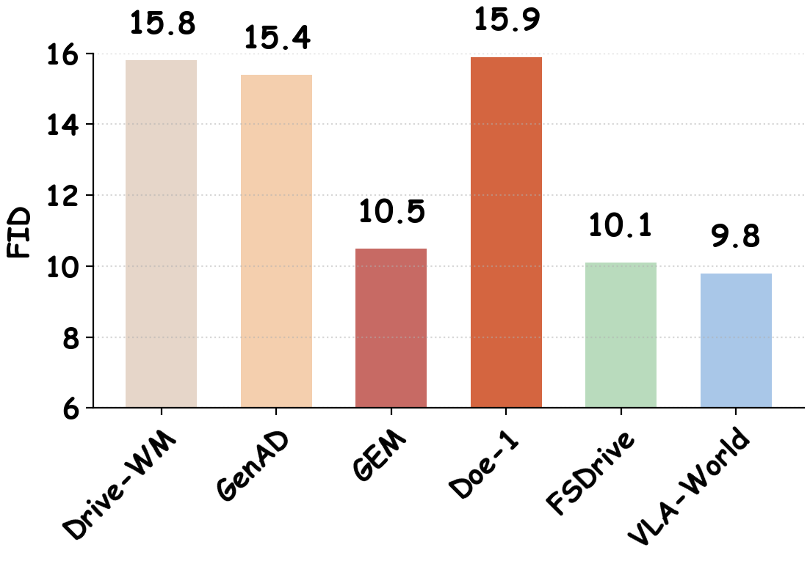
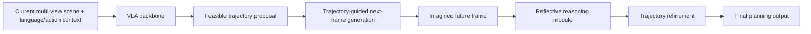

# 自动驾驶论文日报 - 2026-05-15

<!-- PAPER: arxiv-2605.10904 START -->
## Benchmarking Closed-Loop Cooperative Driving for End-to-End Multi-agent Systems
- arXiv: [arXiv:2605.10904](https://arxiv.org/abs/2605.10904)
- 研究问题：现有V2X评测多停留在开环或交互多样性不足的闭环测试，难以真实判断多车协同对规划与安全的实际增益。
- 核心方法：提出 MDrive 闭环协同驾驶基准，构建225个覆盖NHTSA事故原型与真实V2X数据的多主体场景，并配套Real2Sim与人类在环仿真工具链，统一评测感知共享与协商策略。
- 亮点：
  - 明确区分“感知提升”与“规划收益”，可直接诊断协同系统失配。
  - 提供更高交互复杂度与行为多样性，降低开环指标误导。
  - 给出多主体端到端系统在闭环中相对单车系统的系统性对比结论。
- 局限：作为benchmark论文，侧重评测框架而非单一SOTA控制器；复杂拥堵场景下协商策略仍可能退化。

**重点图（方法架构）**

图注核验：Figure 1 presents MDrive as a closed-loop cooperative benchmark, integrating scenario generation, interactive simulation, and evaluation of perception sharing plus negotiation under diverse multi-agent traffic situations.

**Mermaid 架构图**

<!-- PAPER: arxiv-2605.10904 END -->

<!-- PAPER: arxiv-2604.09059 START -->
## Learning Vision-Language-Action World Models for Autonomous Driving
- arXiv: [arXiv:2604.09059](https://arxiv.org/abs/2604.09059)
- 研究问题：端到端VLA驾驶模型缺少显式时序世界建模，导致前瞻性与安全性受限；纯world model又难以对想象结果进行可操作推理。
- 核心方法：提出 VLA-World，把“动作引导未来帧生成”与“基于想象帧的反思式轨迹修正”统一在同一框架，并通过预训练-SFT-RL三阶段训练提升规划与生成一致性。
- 亮点：
  - 把可行轨迹约束注入未来帧生成，强化动态一致性。
  - 在想象未来上再做推理闭环，提升可解释性与决策稳健性。
  - 构建 nuScenes-GR-20K 生成推理数据支持联合优化。
- 局限：生成质量与推理收益高度依赖数据分布；在长时域极端corner case中的稳定性仍需更多闭环验证。

**重点图（方法流程）**

图注核验：Figure 1 illustrates VLA-World’s three progressive stages, where trajectory-conditioned future image generation is followed by reasoning over imagined frames to refine planning decisions.

**Mermaid 架构图**

<!-- PAPER: arxiv-2604.09059 END -->

