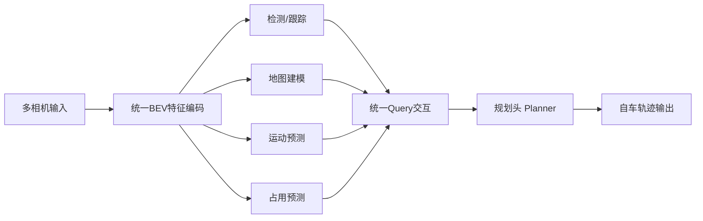

# 自动驾驶论文日报 - 2026-05-17

<!-- PAPER: arxiv-2212.10156 START -->
## Planning-oriented Autonomous Driving
- arXiv: [arXiv:2212.10156](https://arxiv.org/abs/2212.10156)

### 研究问题
传统自动驾驶流水线将感知、预测、规划割裂优化，导致信息损失与误差累积；作者要解决的是：如何把全栈任务统一到“面向规划”的单网络框架中，直接提升最终驾驶规划质量。

### 核心方法
提出 UniAD（Unified Autonomous Driving），把检测、跟踪、建图、运动预测、占用预测与规划放入同一框架，以统一 query 接口在任务间传递信息；训练与设计上以规划目标为中心，前置任务围绕规划提供可用表征，而不是各自独立最优。

### 重点图（方法对应）

图注核验：The figure contrasts modular, multitask, and end-to-end paradigms, then highlights a planning-oriented full-stack design where upstream perception/prediction modules are explicitly organized to serve final trajectory planning.

### 亮点
- 明确提出“规划导向”原则，把自动驾驶全栈任务目标统一到最终驾驶决策。
- 在 nuScenes 上覆盖多任务并取得强结果，验证统一框架在协同优化上的收益。
- 任务间通过统一交互接口通信，减少传统串联系统中的目标错位与累计误差。

### 局限
- 框架复杂、训练成本高，工程部署门槛明显高于单任务或弱耦合方案。
- 对大规模高质量多任务标注与场景覆盖依赖较强，迁移到新域仍需额外适配。

### Mermaid 架构图

<!-- PAPER: arxiv-2212.10156 END -->
