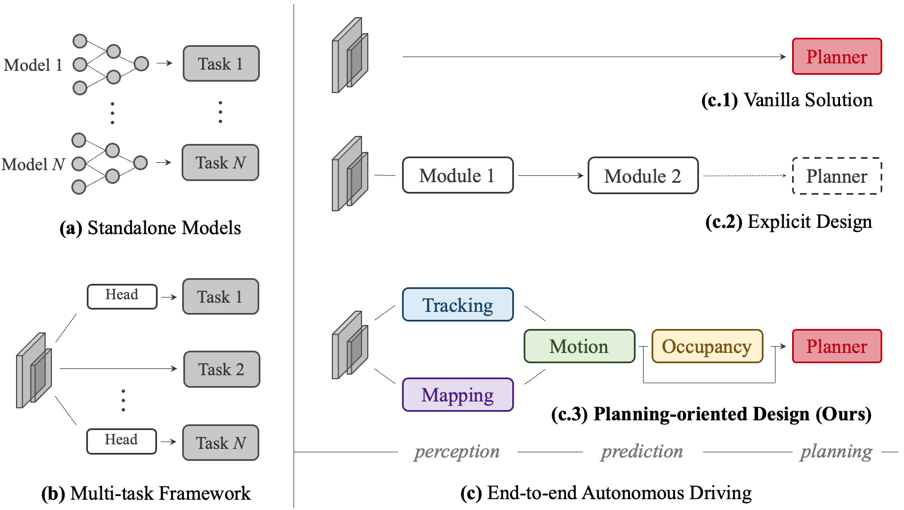
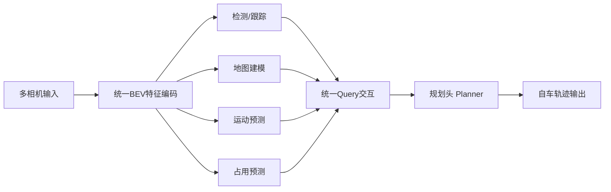

# 自动驾驶论文日报 - 2026-05-17

<!-- PAPER: arxiv-2212.10156 START -->
## Planning-oriented Autonomous Driving
- arXiv: [arXiv:2212.10156](https://arxiv.org/abs/2212.10156)

### 研究问题
传统自动驾驶流水线将感知、预测、规划割裂优化，导致信息损失与误差累积；作者要解决的是：如何把全栈任务统一到“面向规划”的单网络框架中，直接提升最终驾驶规划质量。

### 核心方法
提出 UniAD（Unified Autonomous Driving），把检测、跟踪、建图、运动预测、占用预测与规划放入同一框架，以统一 query 接口在任务间传递信息；训练与设计上以规划目标为中心，前置任务围绕规划提供可用表征，而不是各自独立最优。

### 重点图（方法对应）

图注核验：The figure contrasts modular, multitask, and end-to-end paradigms, then highlights a planning-oriented full-stack design where upstream perception/prediction modules are explicitly organized to serve final trajectory planning.

### 亮点
- 明确提出“规划导向”原则，把自动驾驶全栈任务目标统一到最终驾驶决策。
- 在 nuScenes 上覆盖多任务并取得强结果，验证统一框架在协同优化上的收益。
- 任务间通过统一交互接口通信，减少传统串联系统中的目标错位与累计误差。

### 局限
- 框架复杂、训练成本高，工程部署门槛明显高于单任务或弱耦合方案。
- 对大规模高质量多任务标注与场景覆盖依赖较强，迁移到新域仍需额外适配。

### Mermaid 架构图

<!-- PAPER: arxiv-2212.10156 END -->

<!-- PAPER: arxiv-2604.25329 START -->
## ProDrive: Proactive Planning for Autonomous Driving via Ego-Environment Co-Evolution
- arXiv: [arXiv:2604.25329](https://arxiv.org/abs/2604.25329)

### 为何与自动驾驶相关
这篇工作直接面向端到端自动驾驶规划，核心目标不是做泛化世界模型演示，而是让规划器在真实多车交互中提前“想一步”。它在 NAVSIM v1 上评估，指标也是自动驾驶常用的安全、可行驶区域、碰撞与进度指标，因此相关性很强。

### 方法核心
作者把系统拆成紧耦合的两部分：
- **Ego Module**：基于多视角图像生成多个候选轨迹，并产生带有规划语义的 ego tokens。
- **Environment Module**：在 BEV 空间滚动预测未来场景状态，针对每条候选轨迹并行评估未来后果。

关键不只是“世界模型 rerank 轨迹”，而是做 **ego-environment co-evolution**：规划器输出的 ego token 直接注入世界模型，世界模型再把未来感知到的奖励/风险梯度反传给规划器。论文里还显式建模 no-collision、drivable-area compliance、time-to-collision、ego progress 和 comfort 这些规划分数项。

### 关键结果 / 价值
- 在 **NAVSIM test** 上取得 **PDMS 86.6**，优于表中全部对比方法。
- 细项上达到 **NC 98.0 / DAC 95.4 / TTC 93.7 / EP 80.7**，说明收益不只是“更像专家”，而是同时改善安全性与长时程推进效率。
- 去掉世界模型后，消融结果 **PDMS 从 86.6 降到 83.5**，证明显式未来场景建模不是装饰，而是规划能力提升的主要来源。

### 重点图说明
论文 Figure 1 把三类路线放在一起比较：
1. 传统 reactive planner 只看当前观测出轨迹；
2. world model reranking 先出轨迹再做后验重排；
3. **ProDrive** 则让 planner 与 world model 在特征层和训练梯度层双向耦合。  
这张图最重要的信息是：作者把“未来推演”从后处理模块升级成了规划器训练目标的一部分。
<!-- PAPER: arxiv-2604.25329 END -->

<!-- PAPER: arxiv-2605.10564 START -->
## DeepSight: Long-Horizon World Modeling via Latent States Prediction for End-to-End Autonomous Driving
- arXiv: [arXiv:2605.10564](https://arxiv.org/abs/2605.10564)

### 为何与自动驾驶相关
这篇论文讨论的是端到端自动驾驶中的“长时程前瞻”问题：不是只基于当前帧做规划，而是在 BEV 空间预测连续未来潜在状态，再把这些未来状态用于驾驶决策。评测使用 Bench2Drive 闭环基准，直接对应自动驾驶闭环性能，而不是泛视觉生成任务。

### 方法核心
DeepSight 的核心有两层：
- **长时程世界建模**：不走逐帧像素级自回归，而是在 **BEV latent semantic feature** 空间并行预测多帧未来状态，减少短视预测带来的规划误差。
- **自适应 CoT 推理**：只在长尾场景按需激活文本推理模块，把社会常识与逻辑推理接进驾驶决策，例如让行、复杂交互等场景，从而兼顾性能和推理开销。

作者强调统一生成-理解架构：同一次前向里联合输出未来世界状态、CoT 推理和最终轨迹，而不是额外再挂一个独立生成器或后处理模块。

### 关键结果 / 价值
- 在 **Bench2Drive** 上，DeepSight 相比同协议下的最新 SOTA **AutoVLA**，把 **Driving Score 从 78.84 提升到 86.23（+7.39）**，把 **Success Rate 从 57.73% 提升到 71.36%（+13.63）**。
- 即使 **不启用 adaptive CoT**，仅靠长时程世界建模也已达到 **DS 84.52 / SR 65.91%**，说明主要增益并不依赖“大模型讲道理”，而是来自更强的未来状态建模。
- 论文还报告 open-loop 轨迹预测 **L2 降到 0.58**，说明它不仅闭环更强，预测精度本身也有同步提升。

### 重点图说明
Figure 1 对比了“短视”的单帧未来预测范式与 DeepSight 的多帧 latent state 预测范式：
- 旧范式更像是在猜下一帧外观，容易只看到局部；
- DeepSight 直接在潜在语义空间做连续未来建模，因此更适合服务长时程规划。  
图里还把 DeepSight 在 Driving Score、Success Rate 和效率指标上的领先结果放在一起，直观支撑了“long-horizon world modeling 能换来更好的闭环驾驶”。
<!-- PAPER: arxiv-2605.10564 END -->
